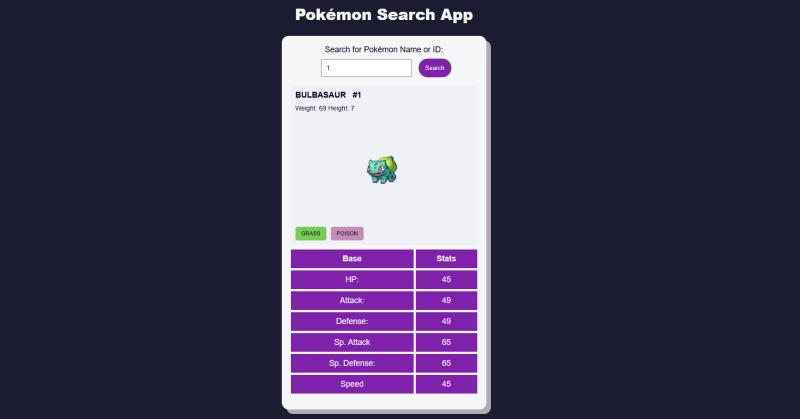

# Pokémon Search App

**Pokémon Finder** é um aplicativo simples e interativo para buscar informações sobre Pokémon. O usuário pode digitar o **nome** ou o **ID** de um Pokémon, e o app retorna informações detalhadas, como os **stats** e a **imagem** do Pokémon, caso ele exista.

## Funcionalidades

- Buscar Pokémon pelo nome ou ID.
- Exibir:
  - Imagem do Pokémon.
  - Informações sobre seus stats.
- Interface amigável e responsiva.

## Imagem do Projeto




## Tecnologias Utilizadas

- **HTML**: Para a criação da interface do usuário.
- **CSS**: Para estilização.
- **PokéAPI**: API utilizada para buscar dados dos Pokémon.
- **JavaScript**: Para adicionar os dados dinamicamente no App.

## Como Rodar o Projeto

1. Clone o repositório:
   ```bash
   git clone git@github.com:damilhome/pokemon-search-app-js.git
2. Navegue até a pasta do projeto:
   ```bash
   cd pokemon-search-app-js

## Links

- Teste o App: [Pokemon Search App](https://damilhome.github.io/pokemon-search-app-js/)
- Conecte-se comigo no [LinkedIn](https://www.linkedin.com/in/danilo-almeida-milhome/)